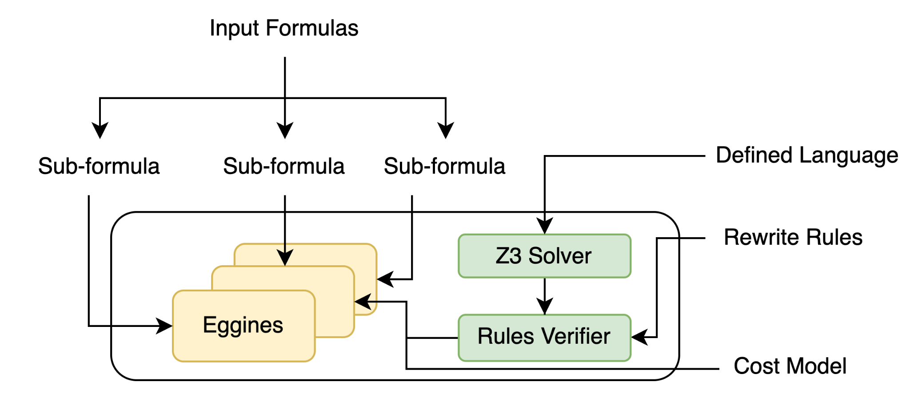
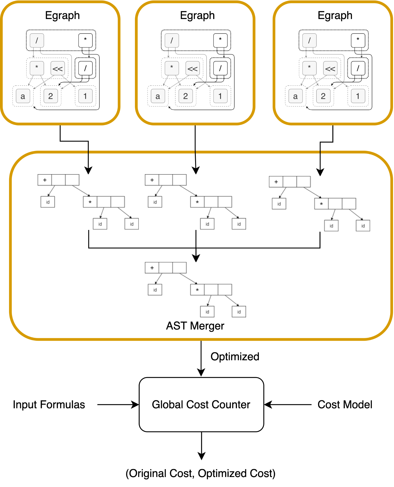

# Eggcelerator: cracking cryptographic speed with e graphs

Given a cost model, we create a Domain Specific Language (DSL) and rewrite rules to find the cheapest logically equivalent form of an expression via algebraic rewrites 

---
### Prerequisites

1. Download [Rust](https://www.rust-lang.org/tools/install)
2. Build all dependencies
```bash
apt install llvm clang libclang-dev
cd src
cargo build
```

### Architecture
The Eggcelerator architecture consists of several key components:



Our system takes input formulas written in a domain-specific language and decomposes them into sub-formulas. These sub-formulas are processed using multiple Eggines, which perform equality saturation guided by a defined set of rewrite rules.

All rewrite rules are verified for correctness using a Z3 Solver and a Rules Verifier, ensuring sound transformations. A cost model is used to extract the most efficient equivalent expression from the e-graph. The result is a set of formally verified, cost-optimized expressions ready for high-performance cryptographic applications.



The figure above shows the detailed architecture of Eggcelerator’s optimization pipeline.

Each input formula is first decomposed into sub-formulas, which are independently optimized using e-graphs via the egg engine. These e-graphs apply rewrite rules to enumerate equivalent expressions by exploiting algebraic identities and structural equivalences.

After saturation, the candidate expressions from each sub-formula are extracted and passed to the AST Merger, which combines them into full candidate expressions for the original formula.

The merged candidates are then evaluated by the Global Cost Counter, which compares the original and optimized expressions using a predefined cost model (e.g., counting field multiplications, additions, or estimating latency).

The output is a pair:
(Original Cost, Optimized Cost) — showing the effectiveness of the transformation.

### Tutorial
TL;DR Quick Command for B1:
```bash
echo -e "(+ (* a0 a0) (* (* a1 a1) x1))\n(* (* a0 2) a1)\ndone" | cargo run ../rules/rules_fp2.txt ../costs/costs_fp2.txt
```
1. Run the program 
```bash
cargo run LocationOfRules* LocationOfCostModel*
```
*These fields are optional and will be assigned to an fp2 default if not inputted

Output:
```
Rule 'add-zero' is valid.
Rule 'zero-add' is valid.
Rule 'mul-one' is valid.
Rule 'one-mul' is valid.
Rule 'mul-zero' is valid.
Rule 'zero-mul' is valid.
Rule 'sub-zero' is valid.
Rule 'sub-self' is valid.
Rule 'sub-to-add' is valid.
Rule 'comm-add' is valid.
Rule 'comm-mul' is valid.
Rule 'assoc-add' is valid.
Rule 'assoc-mul' is valid.
Rule 'distribute' is valid.
Rule 'factor' is valid.
Rule 'square-def' is valid.
Rule 'square-mul' is valid.
Rule '2ab-forward' is valid.
Rule '2ab-backward' is valid.
Rule 'karatsuba' is valid.
Finite Field Expression Optimizer
=================================
Enter an expression to optimize (in S-expression format):
formatted:
```
2. Write your S-expressions and when finished type "done"
```
(+ (* a0 a0) (* (* a1 a1) x1))
```

```
(* (* a0 2) a1)
```
```
done
```
3. You will now see the optimized expressions as well as their costs
```
Optimization Results:
---------------------
Original expression 0:
(+
  (* a0 a0)
  (*
    (* a1 a1)
    x1))
Optimized expression 0:
(+
  (^2 a0)
  (*
    (^2 a1)
    x1))
Original expression 1:
(*
  (* a0 2)
  a1)
Optimized expression 1:
(*
  a1
  (+ a0 a0))
Original total cost: 45
Optimized cost: 34
Improvement: 24.44%

E-Graph Statistics:
Iterations: 30
Total e-graph nodes: 9264
E-classes: 1719
```


### Branch-wise details
TL;DR Benchmark 1, 2, 3:

`git checkout master`

`echo -e "(+ (* ?a0 ?b0) (* ?a1 ?b1))\n(- (* (+ ?a0 ?a1) (+ ?b0 ?b1)) (+ (* ?a0 ?b0) (* ?a1 ?b1)))\ndone" | cargo run rules_fp0.txt costs_fp0.txt`
This example shows how eggcelerator works on Benchmark 1. It demonstrates the Karatsuba multiplication rule, but in this case, no improvement was found.

`echo -e "(+ (* ?a0 ?a0) (* (* ?a1 ?a1) xi))\n(* 2 (* ?a0 ?a1))\ndone" | cargo run rules_fp4.txt costs_fp2.txt`
This example shows how eggcelerator works on Benchmark 2. It demonstrates optimization of elliptic curve addition, reducing the cost of operations by using squaring instead of multiplication and utilizing more efficient constant multiplication patterns. According to the costs defined in costs_fp2.txt (add=1, sub=1, const_mul=4, square=6, mul=10, inv=80), the optimization achieves a 24.44% improvement, reducing the total cost from 45 to 34.

`echo -e "(+ (* x0 y0) (* xi (+ (* x1 y2) (* x2 y1))))\n(+ (+ (* x0 y1) (* x1 y0)) (* xi (* x2 y2)))\n(+ (+ (* x0 y2) (* x1 y1)) (* x2 y0))\ndone" | cargo run rules_fp6.txt costs_fp2.txt`

This example shows how eggcelerator works on Benchmark 3, which involves optimization of Fp6 multiplication. It demonstrates the application of Karatsuba multiplication technique to complex number arithmetic in finite field extensions. The input expressions represent the components of Fp6 multiplication, but in this case, no cost improvement was found because the implemented rules already represent an optimal strategy for the given cost model. Furthermore, eggcelerator processes each expression independently, with no knowledge transfer between subformulas, which limits potential optimizations across the complete Fp6 multiplication algorithm. This benchmark highlights eggcelerator's ability to handle multi-variable expressions and complex algebraic structures, while also showing a limitation in optimizing compound operations.

TL;DR Benchmark 5:

`git checkout hugo`

`echo -e "(** (Fp2 a0 a1) (- p2 2))\ndone" | cargo run ../rules_b5.txt ../costs_b5.txt`

This branch focuses on Benchmark 5 with algorithm 8 of the BGMO paper. The algorithm does not start with Fermat's Little Theorem but the operation is equivalent to doing an inverse. The rewrite rules are in "../rules_b5.txt" and the cost model is in "../costs_b5.txt".
It incorporates the Fp2 DSL which is represented as Fp2 a0 a1. We know that $A^{-1} = \bar A / N(A)$ and the algorithm does exactly this using one inversion in $\mathbb F_p$, reducing the cost from 80 to 26. The exponentation was given a cost of 80 due to it being used for inverse operation in this benchmark.

TL;DR Benchmark 6:

`git checkout richard`

`echo -e "(** (Fp6 g0 g1 g2 h0 h1 h2) (+ (- (** (Fp6 g0 g1 g2 h0 h1 h2) 4) (** (Fp6 g0 g1 g2 h0 h1 h2) 2)) 1))\ndone" | cargo run ../rules/rules_fp6.txt ../costs/costs_fp6.txt`

This branch focuses on Benchmark 6 with algorithm 29, 30, and 31 and section 3.2 of the BMO paper. The rewrite rules are in "../rules/rules_fp6.txt"
It incorporates the Fp6 DSL which is represented as Fp6 g0 g1 g2 h0 h1 h2. Caveats include that any exponentiation has a non-symbolic cost (aka just an integer value) so the cost of p^100 = p^p. 
